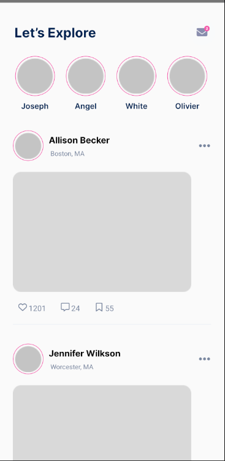

# SocialMedia

My personal project to practice React Native by making an app that is similar to the well-known social media app "Instagram".
This project is mainly to practice the basics of React Native and also to practice the method that is known as "Slicing" which is when a developer creates the interface of an application based on a UI design or mockup that has already been created.

